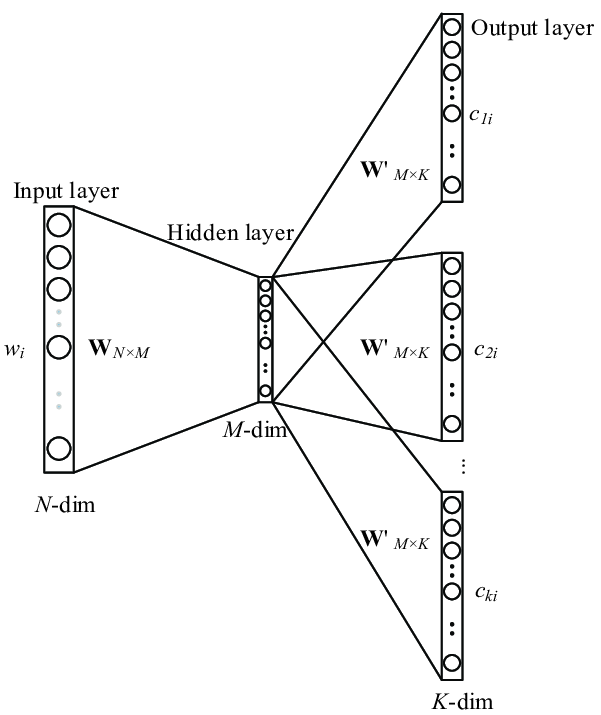

##AI(Aritificial Intelligence)
AI（Artificial Intelligence）、日本語で人工知能。

AIはその言葉単体で多くの物事を含みます。
機械学習や深層学習（ディープラーニング）はその一部です。
それらの目的を簡単に説明するとすれば、これまで単に与えられたデータ、与えられた処理方法を元に、仕事をしてたマシンに、自分で考えて仕事ができるようになってほしいということではないでしょうか。

もちろん、これはざっくりとした説明ですが、実際、人工知能という言葉はそのような人間的思考を求めることが少なからず基本となっていると思います。

映画などでよく見るような、AIロボットが自我を得て人間になろうとする、あるいは、人間にとって変わろうとして人類を滅ぼそうとする。
などというものは極端な描写が多く、見てて不快になる人もいるかもしれませんが、結果的に、それらに共通するものは感情の解釈ではないでしょうか。
目に見えない不確かなものを剥き出しにする機械はとても不気味に見えますが、それらは、人間同士でも同じことです。

人間にはその不確かさを少なからず軽減するための武器として、「言葉」というものを持っています。
言葉を駆使すれば、相手がどのように、何を思っているか、把握できるので、物事を処理するのにはとても便利です。
しかし、現時点でそれらができるのは、理解できる限りでは人間同士だけです。

とはいえ、マシンも似たようなことはできます。
英語をベースとしたほとんどのプログラムはマシン内部で翻訳され、解釈できるようにコンパイルされます。
一方的な処理や、あらかじめ用意したものを元に、決められた動作をすることはもう長い間できていました。

どのようなプログラムも、既存のデータや、入力データを蓄積し、出力するのが基本です。
そのため、そのデータ以上も以下もないのです。
人間の言葉を機械がそのまま解釈し我々の思うように組み立てが難しい理由として、
言葉の重みや、含み、文脈などが挙げられます。

仮に、日→英　英→日で翻訳することについて考えてみましょう。
例えば以下の日本語入力の場合、 

<strong>「彼女は冷たい」　→　"She is cold"</strong>

しかし 

<strong>"She is cold"　→　「彼女は冷たい・寒い」 </strong>

ともなるのです。
おそらく、ほとんどの場合は、「寒い」の方だろうと推測できますが、どちらも成り立ちます。

その場合は、文脈を見て判断をするでしょう。

文脈によって似通った言葉の中から最適なものを選びます。

また、

<strong>"White House"　→　「ホワイトハウス（アメリカ大統領官邸）」</strong>

と解釈することが多いですが、単に、

<strong>"White House"　→　「白い家」</strong>

ともなります。

この場合、会話の状況や文章の文脈が重要な役割を果たすでしょう。

このように言葉は単体ではその意味がはっきりしない場合が多いのです。
それこそがマシンにとって難しいことのです。

人間は生活や環境によって言葉の様々な解釈をします。
推測や、憶測、ニュアンスを汲み取ることなどは、日々の生活の中から学習しているものの一部であるともいえます。

言葉には重みやそれが含む意味があり、その言葉は前後のどの言葉を基本として解釈すれば成り立つのか、
それらを考える場合、機械学習の場合は数値に変換します。

このような技術でマシンにも人間の使う言葉、文章を解釈できるようにしよう、というのが自然言語処理の主な目的です。

自然言語処理は機械学習の中でも、ニューラルネットワークを利用します。

ニューラルネットワークは簡単にいえば、人間の脳機能のようなモデル全般のことをいいます。

自然言語処理でよく使われるモデルの一部として、word2vecというものがあります。

word2vecは２つの手法を用います。

・Skip-Gram Model
・CBOW（Continuous Bag of Words）

この辺りは少し複雑なので、触れる程度でお話しします。

##Skip-Gram Model
Skip-Gram Modelでは、１つの単語から周辺語を予測します。

そしてその蓄積されたデータで学習を重ね、より作成できる文章の精度を上げます。

主に三層に分けられるこのニューラルネットワークは、

このように表されます。

もし、

"I have a dog named Francisco."
（私はフランシスコという名前の犬を飼っています。）

という文がある場合、dogを入力語とする場合、その周辺語は、

"I", "have", "a", "named", "Francisco"　

となります。

つまり、dogという単語が出てくる場合、その周辺にはこれらの単語が出現する可能性がある、ということです。

word2vecではこの入力語から何個目の単語まで取得するかwindow sizeというものを使って設定できます。

前後2単語の場合は、window size=2となります。

例の分の場合、

window size=2とする場合、

影響範囲は、"a", "have", "named", "Francisco"

の前後合計4単語となります。

実際は、より多くの教師データを用い、より多くの設定値を使います。

このように解析を幾度となく繰り返すことによって、
マシンは精度を上げていくのです。

CBOWモデルはこの逆の方式をとった手法になります。

word2vecではこの２つの手法を用いて、先述したwindow sizeや、他にも様々な要素を用い、
自然言語を処理できるのです。

##まとめ
長々と話しましたが、結局、自然言語処理というものは、機械学習（ニューラルネットワーク）を用いたデータ解析の総称のようなものです。人工知能、機械学習などはこのように、人間が日々触れている膨大なデータを使うことによって、マシンにも同じように情報を蓄積させ、それらをより効率的に利用するための手段と言えると思います。結果的に、映画のような事が起きるのは、その目的のためにプログラムするか、そのプログラムの解釈の中で条件が合致した場合に起きうるかもしれませんが、そこまで心配するものではないと個人的には感じました。
